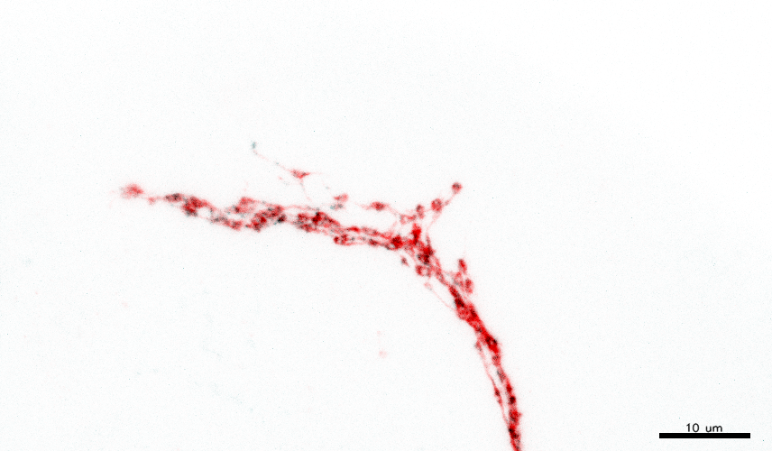

# BackFlip

[](https://doi.org/10.5281/zenodo.17536061)
[](https://opensource.org/licenses/MIT)
[](https://www.python.org/downloads/)

A PyQt-based GUI tool for compositing multi-channel confocal microscopy images with publication-ready white or black backgrounds.

## Features

- Multi-channel support (CZI, TIFF, standard images)
- Z-stack projection (Maximum, Average, Sum)
- Multiple white background algorithms
  - Landini (RGB inversion)
  - HSL/YIQ/CIELab color space inversion
  - ezReverse gray replacement
- Per-channel controls:
  - LUT selection (Gray, Red, Green, Blue, Cyan, Magenta, Yellow, Custom RGB)
  - Contrast and brightness adjustment
  - Background removal filters (Gaussian, Top-hat, Median, Threshold)
- Background removal filters (Gaussian, Top-hat, Median, Threshold)
- Scale bar with customization
- Export to TIFF, PNG, JPEG

## Screenshots




## Installation

### Option 1: From Source
```bash
# Clone the repository
git clone https://github.com/FranTassara/BackFlip.git
cd BackFlip

# Create virtual environment (recommended)
python -m venv venv
source venv/bin/activate  # On Windows: venv\Scripts\activate

# Install dependencies
pip install -r requirements.txt

# Run the application
python BackFlip_GUI.py
```

### Option 2: Standalone Executable (Windows)

Download the latest executable from [Releases](https://github.com/FranTassara/confocal-compositor/releases).

**Windows**: `BackFlip_App_v1.0_Windows.exe` (128 MB)  

## Usage

1. Load your confocal image (CZI, TIFF, or standard format)
2. Adjust per-channel settings (LUT, contrast, filters)
3. Choose background color and method
4. Add scale bar if needed
5. Export your publication-ready image

## License

LGPL v3 - See LICENSE file for details
