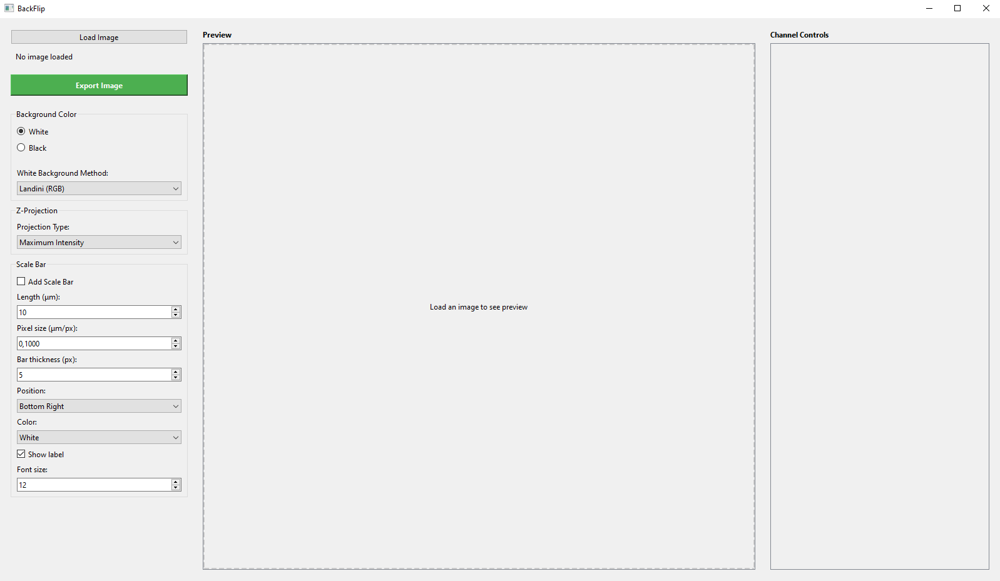
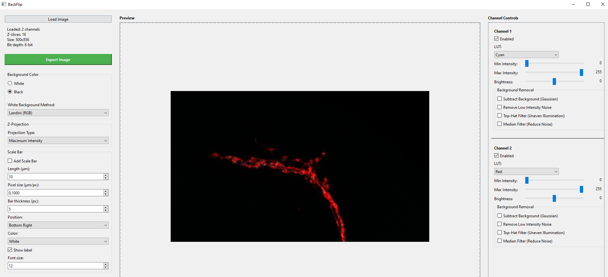
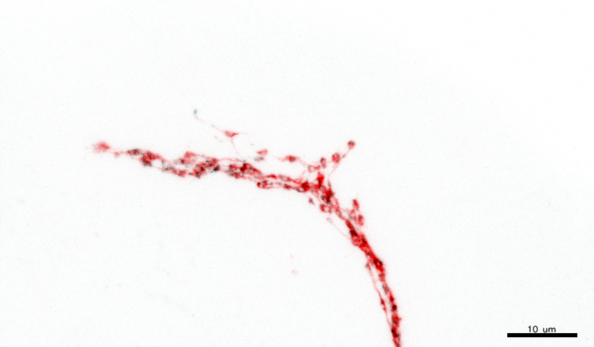

# BackFlip

[](https://doi.org/10.5281/zenodo.17536854)
[](https://opensource.org/licenses/MIT)
[](https://www.python.org/downloads/)

A PySide6-based GUI tool for compositing multi-channel confocal microscopy images with publication-ready white or black backgrounds.

## Features

- Multi-channel support (CZI, TIFF, standard images)
- Z-stack projection (Maximum, Average, Sum)
- Multiple white background algorithms
  - Landini (RGB inversion)
  - HSL/YIQ/CIELab color space inversion
  - ezReverse gray replacement
- Extended LUT library (ChrisLUTs):
  - I-series (9 LUTs): inverted LUTs designed for white background compositing
  - BOP series (3 LUTs): complementary Blue/Orange/Purple set, optimized for black background
  - OPF series (3 LUTs): complementary set with white overlay combination
  - Turbo: perceptually improved rainbow colormap (Google, Apache 2.0)
- Per-channel controls:
  - LUT selection (built-in and ChrisLUTs extended library)
  - Contrast and brightness adjustment
  - Background removal filters (Gaussian, Top-hat, Median, Threshold)
- Scale bar with customization
- Export to TIFF, PNG, JPEG

## Screenshots



### Before & After
| Black Background | White Background |
|------------------|------------------|
|  |  |

## Installation

### Option 1: From Source
```bash
# Clone the repository
git clone https://github.com/FranTassara/BackFlip.git
cd BackFlip

# Create virtual environment (recommended)
python -m venv venv
source venv/bin/activate  # On Windows: venv\Scripts\activate

# Install dependencies
pip install -r requirements.txt

# Run the application
python BackFlip_GUI.py
```

### Option 2: Standalone Executable (Windows)

Download the latest executable from [Releases](https://github.com/FranTassara/BackFlip/releases/tag/v1.0.0).

**Windows**: `BackFlip_App_v1.0_Windows.exe` (128 MB)  

## Usage

1. **Load your image**: Click "Load Image" and select your CZI, TIFF, or standard image file
2. **Adjust channels**: Use the right panel to modify LUT, contrast, and apply filters for each channel
3. **Choose background**: Select white or black background with your preferred conversion method
4. **Add scale bar**: Enable and customize the scale bar in the left panel (calibration read from metadata)
5. **Export**: Click "Export Image" to save your publication-ready figure

## White Background Algorithms

BackFlip offers multiple algorithms for converting black-background fluorescence images to white background. These methods operate on per-channel RGB composites and invert the luminance component using different color space representations.

- **Subtractive RGB (Landini)**: Gabriel Landini's channel inversion method. Computes R′ = 255 − G − B, G′ = 255 − R − B, B′ = 255 − R − G. Best for most multi-channel fluorescence images.
- **HSL/YIQ/CIELab Inversion**: Color space transformations that invert only the lightness component while preserving hue and saturation. Suitable for images requiring perceptually accurate color rendering.
- **ezReverse**: Detects near-grayscale pixels (std(R,G,B) < threshold) and inverts only those, leaving colored pixels unchanged. Ideal for images with predominantly grayscale backgrounds.

## LUT Library

BackFlip includes an extended LUT library sourced from [ChrisLUTs](https://github.com/cleterrier/ChrisLUTs) (Leterrier, 2020), a curated collection of scientifically designed colormaps for fluorescence microscopy.

### I-series LUTs (white background)

I-series LUTs (I Blue, I Cyan, I Forest, I Green, I Magenta, I Purple, I Red, I Yellow, I Bordeaux) map pixel intensity from white (no signal) to a saturated color (maximum signal). They are designed for direct white background visualization without a post-hoc inversion step.

When all active channels use I-series LUTs, BackFlip automatically applies **multiplicative compositing** — equivalent to the behavior of ImageJ/Fiji for inverted LUTs. In this mode, the Background Color selector is disabled, as white background is inherent to the LUT design.

Multiplicative compositing: for *n* channels,

```
composite = ∏(channel_i / 255) × 255
```

This preserves the identity property: white × color = color, and correctly represents co-localization as increasingly dark pixels on a white background.

### BOP and OPF series (black background)

BOP (Blue/Orange/Purple) and OPF (Fresh/Orange/Purple) are complementary LUT sets designed so that all three channels combined produce white when overlaid. They are intended for black background compositing using standard additive blending.

### Turbo

Turbo is Google's perceptually improved rainbow colormap, included under the Apache 2.0 license. It is suitable for single-channel intensity visualization.

### LUT compatibility

I-series LUTs are designed exclusively for white background; standard LUTs (built-in and BOP/OPF) are compatible with both black and white background modes. Mixing I-series and standard LUTs across channels produces incorrect results — BackFlip will display a warning when such a combination is detected.

## License

This project is licensed under the MIT License.

## Acknowledgments

- Built with [PySide6](https://wiki.qt.io/Qt_for_Python) (Qt for Python)
- Extended LUT library from [ChrisLUTs](https://github.com/cleterrier/ChrisLUTs) by Christophe Leterrier (MIT License). Turbo LUT by Google (Apache 2.0 License).
- Thanks to the microscopy community for testing and feedback

**BackFlip** - *Flip your backgrounds, not your workflow.*
